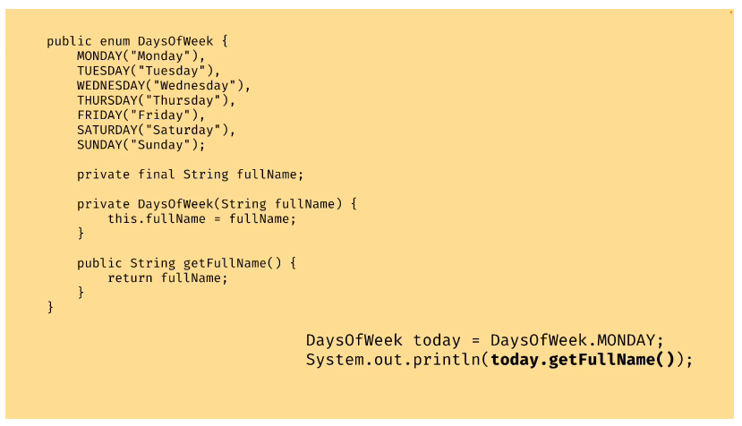

# Key Concepts and Terms

# Class

Class is a blueprint to create objects.

Class contain Data and actions which also known as attributes and method

Variables that belong to an object are usually called **attributes**

- subclass (child) - the class that inherits from another class

- superclass (parent) - the class being inherited from

# Constructors

Used to create an object of a class. It has the same name as the class.
It used to initialize instance variables of the object.

Instance variable is a variable that is declared within a class but outside any method, constructor, or block.

Every java have a constructor if you don't create it will be default constructor.

Constructors have no return type

**super()** for call a constructor in the parent class.
**this()** for call another constructor in its own class.

# Access Modifiers

keyword to control the visibility and accessibility of the class members.
Attributes, methods, constructors and other classes.
Best practice: choose the most restrictive access modifier that is appropriate

1) Public : Accessible from anywhere within the program.
2) Protected : Accessible from anywhere the same package and its subclasses outside the package
3) Default : No modifier. Accessible from anywhere within the same package
4) Private : Accessible from anywhere within the same class

## Static

**The static keyword** is a non-access modifier used for methods and attributes.
Static methods/attributes can be accessed without creating an object of a class.
because It belongs to the class.

## final
- When class is final, it cannot be extended.
- When method is final, it cannot be overridden.
- final variable can only be assign value once.

https://www.w3schools.com/java/java_modifiers.asp

# Method

## return type
    
    void : return nothing

## parameter and argument

    public class Main {
        static void myMethod(String fname) { // parameters
            System.out.println(fname + " Refsnes");
    }
    
        public static void main(String[] args) {
            myMethod("Liam"); // argument
            myMethod("Jenny");
            myMethod("Anja"); 
        }
    
    }

## getter and setter method

    The get method returns the variable value, and the set method sets the value.
    https://www.w3schools.com/java/java_encapsulation.asp

# Object/instance

An object is created from a class.

**instantiate** create an instance of a class.

Are mutable by default

# Packages

Always start with the package statement as the first executable statement of the Java file

They are group of classes. We should use packages to avoid name conflicts, and to write a better maintainable code.

Packages are divided into two categories:
1) Built-in Packages (packages from the Java API) such as Scanner
2) User-defined Packages (create your own packages)

# Variables

2 types of variables

1) Primitive types for primitive values
2) Reference types for objects

## Primitive data types - includes byte, short, int, long, float, double, boolean and char
(https://www.w3schools.com/java/java_data_types.asp)

- For java, primitive type comparison can be done by ==
- Are immutable, but it doesn't mean you can change though just a new one get created when you override its value

## Reference type - includes Class(any build in class such as String, Integer, Double, Boolean, Object, ArrayList), Array and Interface

- For reference types (such as objects), the == operator compares references rather than the actual content of the objects. 
This means it checks whether two variables point to the same object in memory, 
not whether their contents are equal.

- To compare the contents of reference types, you should use the .equals() method:

- UpperCase is a reference type
- Lowercase is a primitive type

## casting

Two types of casting:
1) Widening Casting (automatically) - converting a smaller type to a larger type size
2) Narrowing Casting (manually) - converting a larger type to a smaller size type
https://www.w3schools.com/java/java_type_casting.asp

# OOP

## Inheritance
The ability of a class to inherit properties and methods from a parent class.
Benefit: avoid duplicate code

## Encapsulation
Binding all data and methods together in one object.
Benefit: make sure that "sensitive" data is hidden from users.
https://www.w3schools.com/java/java_encapsulation.asp

## Abstraction
abstract all the difficult things. Only show user necessary things. hiding away the unnecessary details.

## Polymorphism
Many forms. Methods with the same name that can be executed on many objects or classes.

## Overriding, Overloading and Hiding

**Overriding** : new implementation for a method that is inherited from a parent class. `@override`
**Overloading** : Providing multiple methods with the same name, but different signatures due to parameter list

# Interfaces
https://www.w3schools.com/java/java_interface.asp
Contract for a class what specifies which methods a class should have.
Most interface method does not have a body, but It can have a body

When you implement an interface in Java, 
you must provide implementations for all the abstract methods declared in that interface.

### default method
It is a method that has a default implementation in the interface.
Class that implement an interface with a default body, don't need to
implement the default methods. But It is allowed to override it.

    interface ex{
        void method();
        
        default void myDefaultMethod(){
            System.out.println("A default method");
        }
    }

### functional interfaces
Functional interfaces can have more than one method, but only one abstract method.
    
    @FunctionalInterface
    public interface Calculator {
        int calculate(int a, int b);
    }

# Abstract
https://www.w3schools.com/java/java_abstract.asp

abstraction is the process of hiding certain details and showing only essential information to the user.

Abstract class: is a restricted class that cannot be used to create objects or instantiated.
(to access it, it must be inherited from another class).

Abstract method: can only be used in an abstract class, and it does not have a body. 
The body is provided by the subclass (inherited from). Abstract method can be only exist in abstract class.

# Generics and collections

generic can be replaced by any object type not primitive type. For type safety

Collections allow us to store more than one value in one variable.
Collection Framework provides a set of interfaces and classes that can be used to store
and manipulate collections of object.
    
    We can not instantiate bc it is interface
    1) List: we need to specify the type of List content
    2) Set: unordered and the elements don't have an index
    3) Queue: add to the end and remove from the front ex. line of shopping.(FIFO)
    4) Map
## ConcurrentModificationException
https://chatgpt.com/share/6709625d-1b00-800b-a1d6-b77b25c3d11d

# Enums
https://www.w3schools.com/java/java_enums.asp
Special type of Class that has a fixed number of instances. Set of named constants(unchangeable).
Values of the enum are written in UPPERCASE.
can be compared by == syntax.

Enums with member

# lambda expressions
A lambda expression is a way of implementing a functional interface
https://www.w3schools.com/java/java_lambda.asp

Variable using in lambda expression should be final or effectively final.

## useful built in functional expressions
1. Consumer<T>
   T get()
   Purpose: Represents an operation that accepts a single input argument and returns no result.
   
   Consumer<String> greet = name -> System.out.println("Hello, " + name + "!");
   greet.accept("Alice"); // Output: Hello, Alice!

2. Predicate<T>
   Purpose: Represents a predicate (boolean-valued function) that accepts a single input argument.
   
   Predicate<Integer> isEven = n -> n % 2 == 0;
   System.out.println(isEven.test(4)); // Output: true

# Streams API & functional programming
Stream: A sequence of elements from a data source (e.g., collections, arrays) 
that can be processed in a pipeline.

A functional programming approach to process collections of data. 
It allows you to perform operations like filtering, mapping, and reducing 
on collections in a declarative and concise manner.

Streams can only be used once. After a terminal operation the stream is closed.

### Intermediate Operations
Do not change the original stream. return a new stream and are lazy (they are not executed until a terminal operation is called)
Such as `filter`, `map`, `sorted`

### Terminal Operations
Trigger the processing of the stream and consume it. modify the original stream. 
(You cannot use the stream again after a terminal operation).
Such as `forEach`, `collect`, `reduce`, `count`

# Java memory
Heap is the region where objects are stored
Garbage collection automatically reclaim memory occupied by objects that are no longer in use(basiclly remove an object that have nor references to the stack).
JVM tuning : you can use visual VM or java vision control to improve the performance you an adjust heap sizes, select appropriate Garbage collection algorithm for your application

Stack is the area where method calls, local variables, and references to objects
on the heap stored.
Stack is deallocated automatically

Metaspace is the region where class info such as class names, method names, field names is stored

# Concurrency and Multithreading

https://www.w3schools.com/java/java_threads.asp
thread is mini-process, the smallest unit of scheduled execution.
Each thread has its own stack but share heap space

# Concurrency problems

when multiple threads (or a thread and the main program) try to access and modify shared variables simultaneously. 
Since threads can run in parallel, there's no guaranteed order in which they execute. 
This leads to race conditions, where the outcome depends on which thread reads or writes a variable first.

**ways to fix**:
1 Atomic Classes: provide a thread-safe way to perform operations on variables without the need for explicit synchronization.
https://chatgpt.com/share/67095ba8-3710-800b-b208-4a3e5bab208a

2 Synchronization: one at a time
https://chatgpt.com/share/67095ba8-3710-800b-b208-4a3e5bab208a

3 Executor-service: Allows us to manage asynchronous task execution

Deadlock
https://chatgpt.com/share/67098b08-700c-800b-9f3d-a21efc4a6ca5

# post-increment and pre-increment
1) Pre-increment ( ++i ) increases the value of i before the value is used in an expression.
2) Post-increment ( i++ ) increases the value after the expression is evaluated.

# Exceptions
https://www.w3schools.com/java/java_try_catch.asp
When an error occurs, Java will normally stop and generate an error message. 
The technical term for this is: Java will throw an exception (throw an error).
2 types of exception : checked and unchecked exceptions.
check exceptions we need to handle it ourselves.
uncheck exceptions are not handled
type of exception: https://www.geeksforgeeks.org/types-of-exception-in-java-with-examples/
    
    throw new Exception("Exception message");
    
    two ways handling exception is throw and try catch
    
    public void readFile() throws IOException {
        // code that may throw IOException
    }
    
    try{
    
    }catch(Exception e){
    
    }

# Reading and Writing Files
FileReader and FileWriter class(both of this are built in java class)

# Switch Statement

A switch statement is a multiple-choice selection statement that's used when there are multiple choices for an expression 
and the condition is based on a predefined set of values.

    int day = 4;
    switch (day) {
        case 6:
            System.out.println("Today is Saturday");
            break;
        case 7:
            System.out.println("Today is Sunday");
            break;
        default:
            System.out.println("Looking forward to the Weekend");
    }

    // Outputs "Looking forward to the Weekend"

# Do-while loop 

Do-while loop  allows a program  to repeatedly execute block of code as long as given condition is met

    int i = 0;
    do {
        System.out.println(i);
        i++;
    }
    while (i < 5);
    
    // 0
    // 1
    // 2
    // 3
    // 4

# for loop

    for (int i = 0; i <= 10; i = i + 2) {   // start, stop, step
        System.out.println(i);
    }

# for each loop

    String[] cars = {"Volvo", "BMW", "Ford", "Mazda"};
    for (String i : cars) {
        System.out.println(i);
    }

# StringBuilder and StringBuffer

StringBuffer is thread safe but performance is slower StringBuilder.
Usually StringBuilder is the best choice unless you need to worry about thread safety

it is mutable string which unlike String.
https://www.javatpoint.com/StringBuilder-class

    class Example{
        public static void main(String[] args) {
            StringBuilder ex = new StringBuilder("Ford");
            ex.append(" loves food");
            
            String s = ex.toString();
            
        }
    }

# Date & Times
    // local
    import java.time.LocalDate; // immutable
    import java.time.LocalTime; // immutable
    import java.time.ZoneId; 
    import java.time.ZoneDateTime; 

    class Example1{
        public static void main(String[] args) {
            LocalDate x = LocalDate.now();
            LocalDate y = LocalDate.of(2000,4,25);  2000-4-25
            LocalDate z = LocalDate.parse("2011-4-25");  2011-4-25
        }
    }

    class Example2{
        public static void main(String[] args) {
            LocalTime a = LocalTime.now();
            LocalTime b = LocalTime.of(6,30,12);   h/m/s
            LocalTime c = LocalTime.parse("23-59-59");  h/m/s
        }
    }
    
    // Zone
    class Example3{
        public static void main(String[] args) {
            ZoneDateTime zdt1 = ZoneDateTime.now();
            ZoneDateTime zdt2 = ZoneDateTime.of(LocalDateTime.now(), ZoneId.of("Europe/Paris"));
        }
    }
    
# intelliJ syntax shortcut and Tricks

    psvm to create main method
    sout to create System.out.println();

    navigate inside that class `Ctrl + Shift + N`
